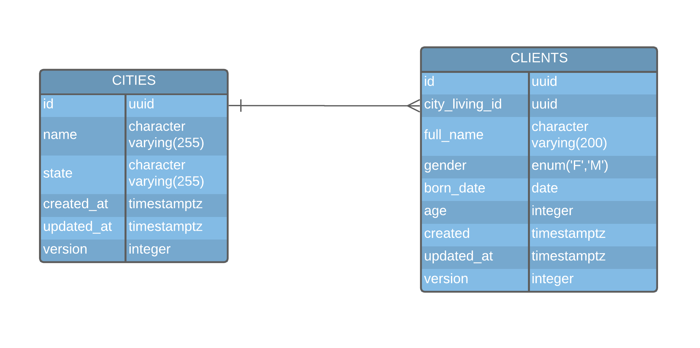

# Test Node Compass UOL
> The code to a node API to the Compass Interview.

## How to run 🚀

- Para construir as imagens docker da API e do banco

```sh
  docker-compose -f docker-compose.dev.yml up -d --build
```

- Para executar as _migrations_

```sh
  yarn typeorm migration:run
```

- Para executar os testes

```sh
  yarn test
```
Todos os comandos executados com YARN são possíveis de executar utilizando o NPM.

<br>

> Depois dessas etapas, a API será acessível em **localhost**, na porta 4000.
<br>
<br>

## Database schema



## Requirements

<details>
  <summary>[1-2]: Cadastrar cidade</summary>
  
  | N° | FR (functional requirements) | NFR (non-functional requirements) | OK |
  |----|------------------------------|-----------------------------------|----------------|
  | 1  | Deve ser possível cadastrar uma nova cidade ao informar corretamente os dados pedidos | | ✅ |
  | 2  | Não é possível cadastrar duas ou mais cidades com o mesmo nome e o mesmo estado | | ✅ |
</details>

<details>
  <summary>[3-4] Consultar cidade pelo nome e/ou estado</summary>

  | N° | FR (functional requirements) | NFR (non-functional requirements) | OK |
  |----|------------------------------|-----------------------------------|----------------|
  | 3  | Deve ser possível buscar uma cidade informando seu nome e/ou o estado a qual pertence | Pode utilizar parametros de query para filtrar | ✅ |
  | 4  | Ao não informar dados para o filtro, poderão ser trazidas todas as cidades | Deverá conter paginação para controle | ✅ |
</details>

<details>
  <summary>[5-7] Cadastrar cliente</summary>

  | N° | FR (functional requirements) | NFR (non-functional requirements) | OK |
  |----|------------------------------|-----------------------------------|----------------|
  | 5  | Deve ser possível cadastrar um novo cliente ao informar corretamente os dados pedidos | | ✅ |
  | 6  | Cada cliente deverá ter uma cidade associada (cidade onde mora) | | ✅ |
  | 7  | Não será possível cadastrar um cliente com data de nascimento maior que a data de hoje | | ✅ |
</details>

<details>
  <summary>[6] Consultar cliente pelo nome</summary>

  | N° | FR (functional requirements) | NFR (non-functional requirements) | OK |
  |----|------------------------------|-----------------------------------|----------------|
  | 6  | Deve ser possível buscar clientes informando seu nome (ou parte) | Pode utilizar parametros de query para filtrar ou parâmetro de rota | ✅ |
</details>

<details>
  <summary>[7] Consultar cliente pelo Id</summary>

  | N° | FR (functional requirements) | NFR (non-functional requirements) | OK |
  |----|------------------------------|-----------------------------------|----------------|
  | 7  | Deve ser possível buscar um cliente específico informando seu identificador | Utilizar parâmetros de rota | ✅ |
</details>

<details>
  <summary>[8-9] Remover cliente</summary>

  | N° | FR (functional requirements) | NFR (non-functional requirements) | OK |
  |----|------------------------------|-----------------------------------|----------------|
  | 8  | Deve ser possível remover um cliente informando seu identificador | Utilizar parâmetros de rota | ✅ |
  | 9  | Não será possível remover um cliente cujo não seja identificado | | ✅ |
</details>

<details>
  <summary>[10-11] Alterar o nome do cliente</summary>

  | N° | FR (functional requirements) | NFR (non-functional requirements) | OK |
  |----|------------------------------|-----------------------------------|----------------|
  | 10 | Deve ser possível alterar o nome do cliente | Utilizar parâmetros de rota | ✅ |
  | 11 | Não será possível atualizar um cliente cujo não seja identificado | | ✅ |
</details>